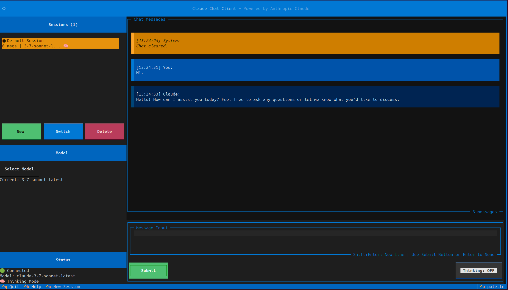

# Claude Chat Client

[](https://opensource.org/licenses/MIT)
[](https://www.python.org/downloads/)
[](https://github.com/psf/black)

A simple terminal-based chat client for Anthropic's Claude AI, built with Python and featuring a modern text user interface powered by Textual.

## Overview

This lightweight chat client provides an intuitive way to interact with Claude through your terminal. It leverages LangChain's Anthropic integration for seamless API communication and includes a straightforward in-memory session management system for maintaining conversation context.

### Key Features

- **Terminal UI**: Clean, keyboard-driven interface using Textual framework
- **Multi-Session Support**: Create and switch between multiple conversation sessions
- **In-Memory Storage**: Simple session memory that maintains conversation history during runtime
- **Model Selection**: Dynamically fetches and allows switching between available Claude models
- **Claude 3.7 Thinking Mode**: Support for Claude's advanced reasoning capabilities
- **Export Options**: Save conversations in JSON, Markdown, or plain text formats

## Technical Architecture

### LangChain Integration
The client uses LangChain's `langchain-anthropic` package to handle Claude API interactions. This provides:
- Streaming response support for real-time message display
- Automatic token management and counting
- Built-in error handling and retry logic
- Clean abstraction over the raw Anthropic API

### Session Memory Management
The application implements a simple in-memory session manager that:
- Stores conversation history in Python data structures during runtime
- Maintains multiple concurrent sessions without persistence
- Provides message search and filtering capabilities
- Optimizes memory usage by summarizing old messages when limits are reached
- Note: Sessions are lost when the application closes (no file persistence)

## Screenshots


*Terminal UI with active chat session - showing the Textual interface with conversation history, input area, and session sidebar*

## Installation

### Prerequisites
- Python 3.8 or higher
- An Anthropic API key ([Get one here](https://console.anthropic.com/))

### Setup Steps

1. **Clone the repository**
   ```bash
   git clone <repository-url>
   cd chat_client
   ```

2. **Create a virtual environment** (recommended)
   ```bash
   python -m venv .venv
   source .venv/bin/activate  # On Windows: .venv\Scripts\activate
   ```

3. **Install dependencies**
   ```bash
   pip install -r requirements.txt
   ```
   
   For development:
   ```bash
   pip install -r requirements-dev.txt
   ```

4. **Configure environment variables**
   ```bash
   cp .env.example .env
   ```

5. **Add your Anthropic API key**
   
   Open `.env` in your text editor and update the following line:
   ```
   ANTHROPIC_API_KEY=sk-ant-api03-YOUR-KEY-HERE
   ```
   
   You can obtain an API key from the [Anthropic Console](https://console.anthropic.com/).

6. **Run the application**
   ```bash
   python main.py
   ```

## Configuration

The `.env` file contains various configuration options:

```env
# Required
ANTHROPIC_API_KEY=          # Your Anthropic API key

# Model Settings
CLAUDE_MODEL=claude-3-7-sonnet-latest
MAX_TOKENS=4000
TEMPERATURE=0.7

# Features
THINKING_MODE=true           # Enable Claude 3.7 thinking mode
THINKING_BUDGET_TOKENS=2000

# Memory Management
MAX_MEMORY_MESSAGES=50       # Maximum messages kept in memory
AUTO_SAVE_INTERVAL=300       # Placeholder for future persistence
```

## Usage

### Keyboard Shortcuts
- `Enter`: Send message
- `Shift+Enter`: New line in message
- `Ctrl+Q`: Quit application
- `Ctrl+H` or `F1`: Show help
- `Ctrl+N`: Create new session
- `Ctrl+S`: Show sessions list
- `ESC` or `Ctrl+L`: Clear input
- `/help`: Display available commands

### Commands
Type these commands in the chat input:
- `/help` - Show available commands
- `/clear` - Clear current session
- `/model` - Change Claude model
- `/export` - Export conversation
- `/sessions` - List all sessions
- `/new` - Create new session

## Important Notes

- **Simple Design**: This is a basic chat client focused on ease of use
- **No Persistence**: Conversations are stored in memory only and will be lost when the application closes
- **API Costs**: Using Claude API incurs costs based on token usage
- **Network Required**: Requires internet connection to communicate with Anthropic's servers

## Development

### Running Tests
```bash
pytest tests/
```

### Code Formatting
```bash
black src/ tests/
flake8 src/ tests/
```

## Contributing

Contributions are welcome! Please read our [Contributing Guidelines](CONTRIBUTING.md) for details on how to submit pull requests, report issues, and contribute to the project.

## Testing

Run the test suite:
```bash
pytest tests/
```

With coverage:
```bash
pytest tests/ --cov=src
```

## Roadmap

- [ ] Persistent storage backend (SQLite/JSON)
- [ ] Conversation branching
- [ ] Plugin system for custom commands
- [ ] Web UI option
- [ ] Voice input/output support
- [ ] Multi-user support
- [ ] Conversation templates
- [ ] Advanced prompt engineering tools

## Troubleshooting

### Common Issues

1. **API Key Not Found**
   - Ensure your `.env` file contains `ANTHROPIC_API_KEY=sk-ant-...`
   - Check that the `.env` file is in the project root

2. **Import Errors**
   - Make sure you've activated your virtual environment
   - Verify all dependencies are installed: `pip install -r requirements.txt`

3. **UI Display Issues**
   - Ensure your terminal supports Unicode
   - Try resizing your terminal window
   - On Windows, you may need to install Windows Terminal

4. **Rate Limiting**
   - The app will automatically handle rate limits with retries
   - Consider reducing request frequency if persistent

## License

MIT License

Copyright (c) 2025

Permission is hereby granted, free of charge, to any person obtaining a copy
of this software and associated documentation files (the "Software"), to deal
in the Software without restriction, including without limitation the rights
to use, copy, modify, merge, publish, distribute, sublicense, and/or sell
copies of the Software, and to permit persons to whom the Software is
furnished to do so, subject to the following conditions:

The above copyright notice and this permission notice shall be included in all
copies or substantial portions of the Software.

THE SOFTWARE IS PROVIDED "AS IS", WITHOUT WARRANTY OF ANY KIND, EXPRESS OR
IMPLIED, INCLUDING BUT NOT LIMITED TO THE WARRANTIES OF MERCHANTABILITY,
FITNESS FOR A PARTICULAR PURPOSE AND NONINFRINGEMENT. IN NO EVENT SHALL THE
AUTHORS OR COPYRIGHT HOLDERS BE LIABLE FOR ANY CLAIM, DAMAGES OR OTHER
LIABILITY, WHETHER IN AN ACTION OF CONTRACT, TORT OR OTHERWISE, ARISING FROM,
OUT OF OR IN CONNECTION WITH THE SOFTWARE OR THE USE OR OTHER DEALINGS IN THE
SOFTWARE.

## Acknowledgments

- Built with [LangChain](https://python.langchain.com/) for LLM orchestration
- UI powered by [Textual](https://textual.textualize.io/) for rich terminal interfaces
- API provided by [Anthropic](https://www.anthropic.com/) Claude
- Programming assistance from **Claude Code**
